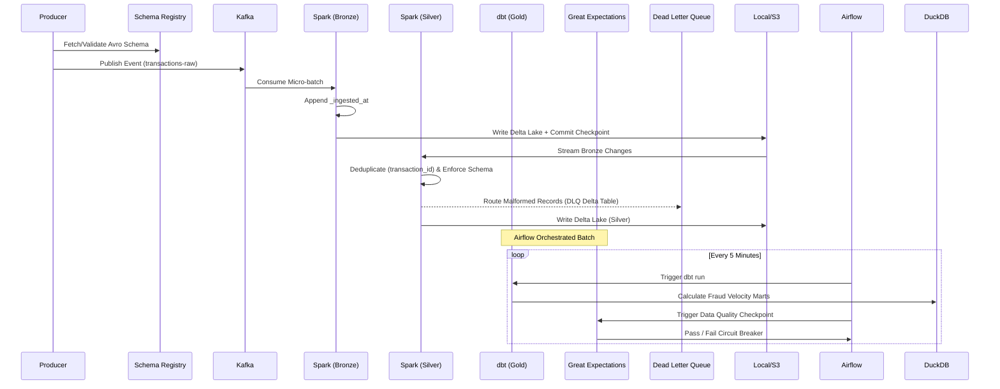

# System Architecture & Design Decisions

**FinStream** is a real-time data pipeline that ingests synthetic financial transactions and processes them through a Medallion Architecture (**Bronze → Silver → Gold**). 

This document details the chronology, component choices, operational standards, and key engineering trade-offs made during its design.

---

## Data Flow & Chronology

While the topology runs in three distinct layers, the chronological lifecycle of a single transaction flows as follows:

### 1. Event Generation (Source)
A Python-based producer generates synthetic financial transactions using the `Faker` library. Before publishing to the `transactions-raw` Kafka topic, the producer validates each payload against a strict Avro schema fetched dynamically from a containerized Confluent Schema Registry.

* **Why This Matters:** This acts as a strict data contract at the source. It prevents malformed data, guarantees forward/backward schema compatibility, and significantly reduces network payload size compared to plain JSON.

### 2. Bronze Layer (Raw Ingestion)
A PySpark Structured Streaming job consumes the Kafka topic in real time.

* **Responsibilities:**
  * Consume raw Kafka events.
  * Append an ingestion metadata timestamp (`_ingested_at`).
  * Write records into a Delta Lake table.
  * Maintain Spark checkpoints.
* **Why Bronze Exists:** The Bronze layer acts as the immutable historical audit trail. All raw events are preserved exactly as received, allowing historical replay, debugging, backfills, and recovery from downstream logic failures.

### 3. Silver Layer (Cleansed & Conformed)
A second PySpark process continuously reads from the Bronze Delta table.

* **Responsibilities:**
  * Schema enforcement and casting.
  * Deduplication using `transaction_id`.
  * Routing invalid records to a DLQ.
* **Dead Letter Queue (DLQ):** Records that fail validation (e.g., missing critical fields) are written to a separate Delta table. This prevents malformed records from crashing the primary streaming pipeline while preserving them for investigation and future reprocessing.

### 4. Gold Layer (Business Aggregates)
`dbt` transforms Silver-layer data into analytical models focused on fraud detection.

* **Responsibilities:**
  * Rolling 1-hour transaction velocity calculations.
  * Fraud-risk flag generation.
  * Business-oriented analytical marts.
* **Serving Layer:** The final models are materialized in DuckDB, providing extremely fast analytical queries and SQL-based transformations with zero cloud infrastructure cost.

---

## Operational Characteristics

### Non-Functional Requirements (NFRs)
*(Targeting the current Local MVP state)*

| Metric | Target |
| :--- | :--- |
| **Throughput** | ~50 - 100 transactions per second (TPS). |
| **Bronze Ingestion Latency** | < 5 seconds (bound by Spark micro-batch trigger interval). |
| **Gold Refresh Rate** | Near real-time (bound by Airflow DAG scheduling, currently simulating a 1 to 5-minute refresh). |

### Data Retention & Archival Policy

* **Kafka:** Topics configured with a 72-hour retention policy. Kafka is treated purely as a transit buffer, not a storage layer.
* **Bronze (Delta Lake):** Infinite retention. Acts as the permanent system of record.
* **Silver (Delta Lake):** Delta `VACUUM` policies can be applied to remove historical files older than 7 days, maintaining a 7-day time travel window to save disk space.
* **Gold (DuckDB):** Entirely ephemeral. Can be dropped and completely rebuilt from the Silver layer at any time via `dbt run --full-refresh`.

### Security & Compliance Profile

> **Note:** As a local portfolio project, this environment runs without enterprise encryption to facilitate easy local debugging. However, migrating this architecture to a production cloud environment would require the following implementations:

* **In-Transit Encryption:** Kafka listeners and PySpark communication would require TLS 1.2+ (e.g., AWS MSK with TLS enabled).
* **At-Rest Encryption:** Delta Lake S3 buckets would enforce Server-Side Encryption with KMS (SSE-KMS).
* **PII Masking:** Personally Identifiable Information (like raw account numbers) would be dynamically masked using Databricks Unity Catalog or hashed in the Silver layer.
* **Authentication:** Airflow, Grafana, and Schema Registry would integrate with corporate SSO/OIDC rather than default admin credentials.

### Failure Modes & Recovery

| Failure Mode | Built-in Recovery Strategy |
| :--- | :--- |
| **Spark Container Crash** | Spark checkpointing allows immediate recovery from the last committed Kafka offset after container restart. |
| **Kafka Retention Expiry** | Bronze Delta Lake acts as the permanent source of truth for historical data; Kafka expiry does not result in data loss. |
| **Malformed Data Spikes** | Invalid records are routed to the DLQ instead of terminating the streaming job. |
| **Gold-Layer Logic Errors** | Great Expectations failures stop downstream Airflow execution, acting as a circuit breaker before serving bad data. |

---

## Engineering Trade-offs

### 1. Avro Serialization vs. JSON
* **Benefit:** Compact binary format, reduced network bandwidth, and strong schema typing.
* **Trade-off:** Additional infrastructure requirements (Schema Registry) and harder debugging because Kafka payloads are not human-readable.

### 2. Delta Lake vs. Standard Parquet
* **Benefit:** Provides ACID transactions, schema evolution, and safer concurrent reads/writes for streaming workloads.
* **Trade-off:** Delta Lake maintains a `_delta_log` directory, increasing file count, metadata overhead, and storage footprint compared to plain Parquet.

### 3. PySpark Structured Streaming vs. Lightweight Consumers
* **Benefit:** Exactly-once processing, stateful watermarking, checkpoint recovery, and native Kafka integration.
* **Trade-off:** Introduces JVM overhead, increased memory consumption, and greater operational complexity than lightweight Python consumers.

### 4. DuckDB + dbt vs. Cloud Data Warehouses
* **Benefit:** Full SQL support, window functions, tight dbt integration, and zero cloud cost.
* **Trade-off:** Single-node analytical engine; does not scale horizontally like Snowflake or BigQuery.

### 5. Data Quality as a Contract (Great Expectations)
* **Benefit:** Declarative data quality rules, automated validation, and pipeline gating.
* **Trade-off:** Expectation suites require significant initial setup and ongoing maintenance as business rules evolve.

### 6. Orchestration vs. Streaming Isolation
Airflow orchestrates `dbt` transformations and Great Expectations validations, but it does not run the continuous streaming ingestion jobs.
* **Benefit:** Prevents batch-processing failures from interrupting continuous 24/7 data ingestion.
* **Trade-off:** Two distinct execution models (long-running streams + scheduled batches) must be operated and monitored simultaneously.

---

## Future Architecture Capabilities

The following enhancements are not implemented today, but represent the roadmap for evolving this project into an enterprise-grade cloud deployment.

### Cloud Managed Infrastructure
Migrate from local Docker containers to fully managed cloud services (e.g., AWS MSK for Kafka, Databricks for Spark, and Snowflake for the Gold serving layer).

### Automated DLQ Alerting
Implement custom Prometheus exporters around the Dead Letter Queue folder to detect malformed-data spikes and generate PagerDuty/Slack operational alerts.

### Active Alerting Sinks
Publish high-risk fraud events from the Gold layer directly back into a new Kafka topic to trigger real-time notification systems and downstream automated fraud workflows.
