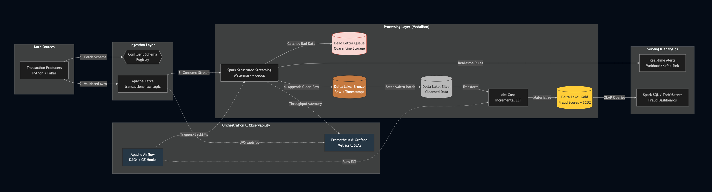

# FinStream: Real-Time Transaction Processing & Fraud Detection Pipeline


**FinStream** is a real-time data pipeline that ingests synthetic financial transactions and processes them through a strict **Medallion Architecture** (Bronze → Silver → Gold). It uses Delta Lake, PySpark Structured Streaming, dbt, and Great Expectations to demonstrate streaming, lakehouse, and data quality patterns in a local environment.

## What This Project Demonstrates

- Streaming data ingestion with **exactly-once semantics** using PySpark Structured Streaming and Delta Lake checkpoints.
- **Lakehouse implementation** with ACID transactions, schema evolution, and time travel on Bronze and Silver layers.
- Data quality enforcement using **Great Expectations** as executable contracts on the Gold layer.
- Analytical transformations for fraud velocity metrics built with **dbt + DuckDB**.
- Observable pipeline using Airflow, Prometheus, and Grafana.

## Prerequisites

- Docker and Docker Compose
- Python 3.11+
- Minimum 16GB RAM recommended
- macOS or Linux (tested on MacBook Air M2)

## Data Model – Gold Layer

The Gold layer produces fraud velocity metrics:

| Column                    | Description                                          |
|---------------------------|------------------------------------------------------|
| `user_id`                 | Unique account identifier                            |
| `transaction_count_1h`    | Number of transactions in the last 1-hour window     |
| `total_amount_1h`         | Total transaction amount in the last hour            |
| `is_high_velocity_flag`   | Boolean flag for high-risk velocity patterns         |

## Architecture Overview



The diagram above shows the complete data flow: synthetic transactions are generated and published to Kafka, ingested into Delta Lake (Bronze), cleaned and validated in Silver, transformed into fraud analytics in Gold using dbt, and validated with Great Expectations before being served through dashboards and alerts.

## Quick Start

```bash
git clone https://github.com/aditya388182/finstream_proj_1.git
cd finstream_proj_1
./start.sh
```

> **Note:** The first run may take 2–3 minutes as Docker pulls the required images and starts all services.

Once running:

- **Airflow**: http://localhost:8080 → Unpause `finstream_realtime_dag`
- **Grafana**: http://localhost:3000
- **Great Expectations Data Docs**: `gx/uncommitted/data_docs/`

## Project Structure

```
finstream_pipeline/
├── src/
│   ├── producer/           # Data generator
│   ├── spark_jobs/         # Bronze & Silver processing
│   └── data_quality/       # Great Expectations
├── docker/                 # Docker Compose files
├── gold_analytics/         # dbt project (DuckDB)
├── gx/                     # Great Expectations expectations & checkpoints
├── orchestration/          # Airflow DAGs
└── infrastructure/         # Terraform (optional)
```

## Key Engineering Decisions

| Decision                        | Rationale                                                                 | Trade-off Accepted |
|--------------------------------|---------------------------------------------------------------------------|--------------------|
| **Delta Lake (Bronze & Silver)** | Adds ACID transactions, schema evolution, time travel, and efficient upserts for streaming workloads | Slightly higher storage overhead due to `_delta_log` directory |
| **PySpark Structured Streaming** | Provides native exactly-once semantics, watermarks, and stateful processing through checkpoints | Higher memory and CPU usage than lightweight consumers |
| **dbt + DuckDB for Gold**       | Enables fast local SQL transformations with strong modeling capabilities and no cloud infrastructure cost | Not designed for high concurrency or very large-scale analytics |
| **Great Expectations**          | Supports declarative data contracts with automatic documentation and validation | Requires upfront effort to define and maintain expectation suites |
| **Dead Letter Queue (DLQ)**     | Prevents malformed records from breaking the main pipeline                | Requires separate monitoring of DLQ volume and content |

## Data Quality & Validation

Great Expectations validates critical business rules on the Gold layer. You can run validations independently using:

```bash
python -m src.data_quality.run_checkpoint
```

Validation failures will also cause the Airflow DAG to fail, preventing bad data from reaching downstream consumers.

## Observability

- **Prometheus + Grafana** dashboards monitor pipeline health, processing lag, and data freshness.
- **Delta Lake checkpoints** ensure fault-tolerant streaming with exactly-once guarantees.
- **Airflow** orchestrates the batch components (dbt runs and data quality checks) and supports rapid failure recovery.

## Development Environment

This project was developed and tested on a MacBook Air M2 with 16GB RAM using Docker Desktop.

## Teardown

```bash
docker compose -f docker/observability-compose.yml down
docker compose -f docker/airflow-compose.yml down
docker compose -f docker/docker-compose.yml down
```

## Future Improvements

- Move from a single Docker-based Kafka broker to a multi-broker configuration or a managed Kafka service with Schema Registry.
- Integrate Great Expectations validation as a blocking task directly inside the Airflow DAG.
- Add automated testing for Spark jobs and dbt models.
- Improve the local development experience for testing streaming jobs without requiring the full Docker stack.
- Explore better testing strategies and incremental approaches for the dbt Gold layer.
- Implement active real-time alerting by routing flagged transactions to a dedicated Kafka sink and triggering Slack webhooks.
- Deploy a dedicated OLAP serving layer (e.g., Apache Spark Thrift Server or Trino) to expose the Gold tier for highly concurrent BI reporting.
